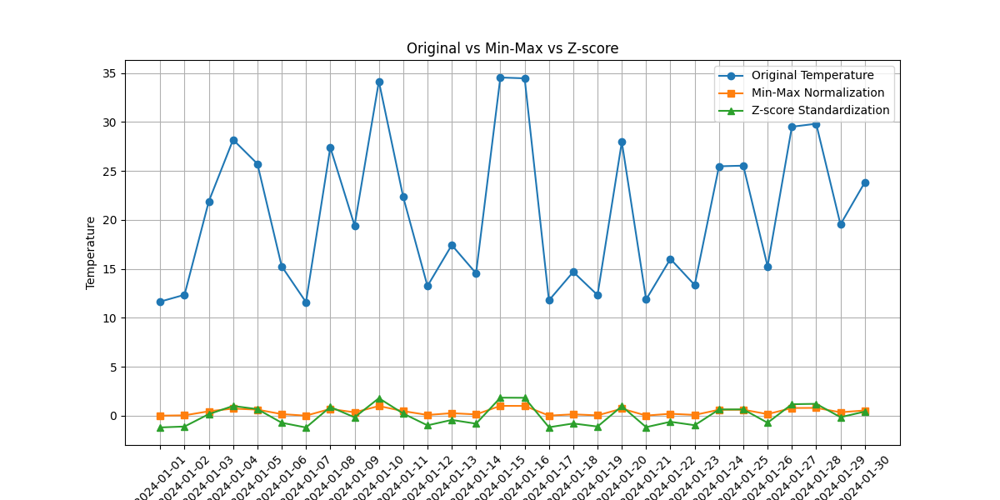

# Weather Data Normalization 

[](https://colab.research.google.com/github/missyben10/Weather-Data-Normalization/blob/main/weather_normalization.ipynb)

This project demonstrates how to **normalize weather temperature data** using two common methods:  
- **Min-Max Normalization** (scales values between 0 and 1)  
- **Z-score Standardization** (scales values relative to mean and standard deviation)  

Here is the original dataset for preview:


Here is the plot generated after normalization:



---

Here is the processed dataset for preview:


## 🔹 Features
- Load temperature dataset from CSV (`weather_data.csv`)  
- Normalize data using:
  - Min-Max Normalization  
  - Z-score Standardization  
- Compare original and normalized values using line plots  
- Save processed dataset into `processed_weather_data.csv`  
- Save comparison graph as `plot.png`  

---

## 🔹 Installation
Clone this repository and install the required dependencies:

```bash
git clone https://github.com/missyben10/Weather-Data-Normalization.git
cd Weather-Data-Normalization
pip install -r requirements.txt
